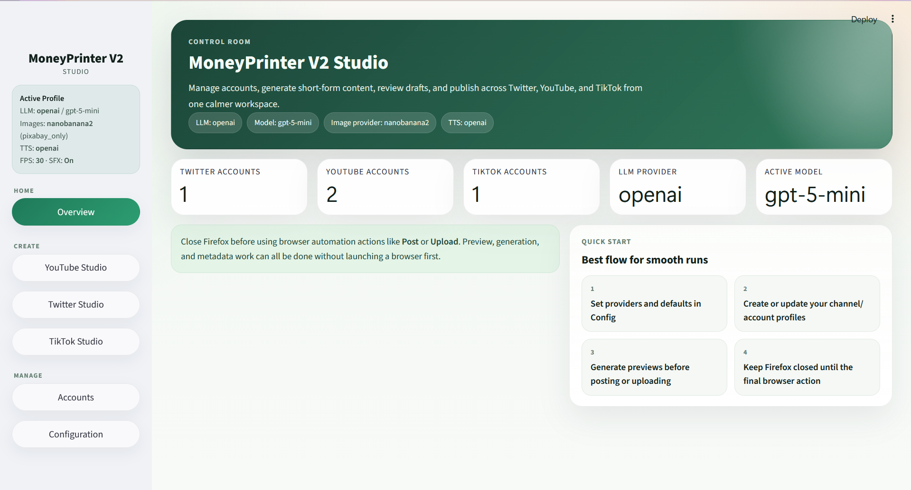
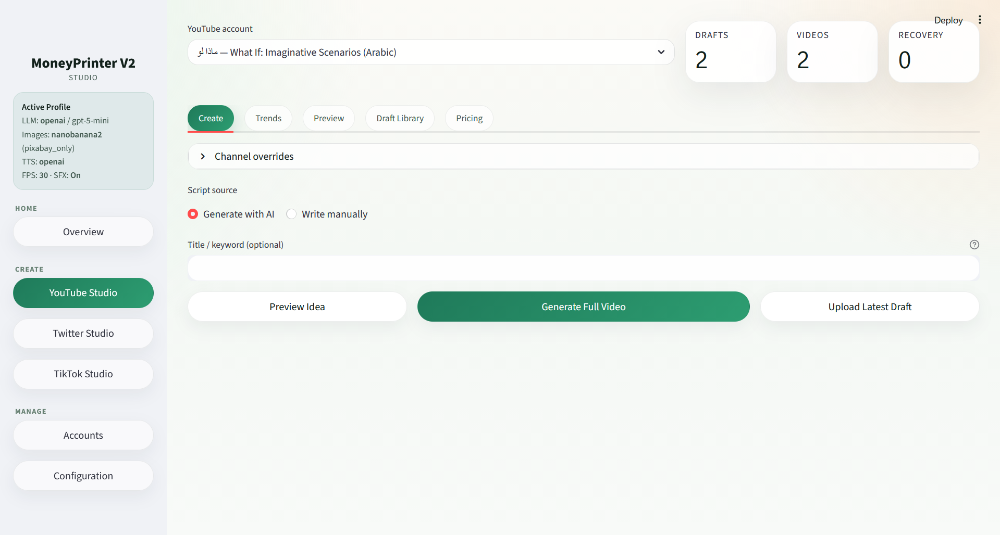
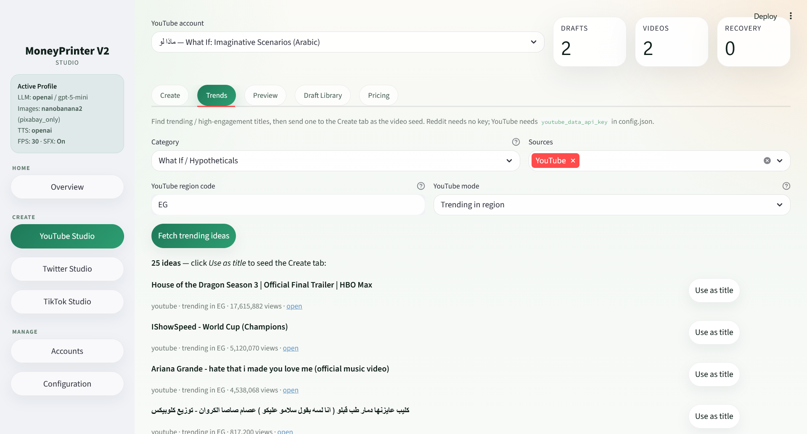

# MoneyPrinterPro

> ⚡ **Automate faceless short-form video — end to end.** Give it a topic (or a trending title) and
> MoneyPrinterPro writes the script, generates the voiceover and visuals, composites a captioned
> vertical video, and uploads it to YouTube & TikTok. Ships with a browser studio, built-in trend
> discovery, multi-provider AI, and first-class Arabic support.

[](https://github.com/ahmadhozien/money-printer-pro/blob/main/LICENSE)
[](https://github.com/ahmadhozien/money-printer-pro/issues)
[](https://github.com/ahmadhozien/money-printer-pro/stargazers)

> Built on [FujiwaraChoki/MoneyPrinterV2](https://github.com/FujiwaraChoki/MoneyPrinterV2) —
> an independent project under the same **AGPL-3.0** license. See [Credits](#credits).

MoneyPrinterPro is a Python 3.12 app (CLI **and** Streamlit GUI) that automates short-form content
creation and social-media outreach end to end — plus tooling for Twitter/X, affiliate marketing,
and local-business cold outreach.

## 🎬 Example videos

Fully auto-generated Arabic Shorts (click to watch):

<p align="center">
  <a href="https://youtube.com/shorts/DAKmlHHsTq4"></a>
  <a href="https://youtube.com/shorts/l0cUBOfN7UI"></a>
  <a href="https://youtube.com/shorts/OS0IqtQn1_I"></a>
  <a href="https://youtube.com/shorts/iDA8npQBTv4"></a>
</p>

## 🖥️ The Studio

A browser dashboard to generate, find trends, preview, and publish — no terminal required.

<p align="center">
  <br/>
  <em>Control room — providers, account counts, and quick-start flow at a glance.</em>
</p>
<p align="center">
  <br/>
  <em>YouTube studio — seed a title, override channel settings, generate or upload.</em>
</p>
<p align="center">
  <br/>
  <em>Trends — pull what's trending (Reddit/YouTube, by region) and one-click seed a video.</em>
</p>

## Why MoneyPrinterPro

On top of the original MoneyPrinter pipeline, MoneyPrinterPro adds:

- 🎛️ **Browser studio (Streamlit GUI)** — generate, preview, edit scenes, manage drafts, pick stock
  footage, and see cost reports in the browser (`run_gui.bat` / `streamlit run app_gui.py`).
- 🔥 **Trend discovery** — pull trending / high-engagement titles from **Reddit & YouTube** (by niche
  or by region), then one-click seed a video around them.
- 🌍 **First-class Arabic / MENA support** — Egyptian & MSA dialects, Arabic-aware subtitles and
  fonts, Arabic TTS, and region/language-aware trends (works for English and other languages too).
- 🧩 **Multi-provider** LLM / image / TTS / STT — OpenAI, OpenRouter, Pixabay, Nano Banana 2 (Gemini),
  KittenTTS, local Whisper, AssemblyAI. Cloud calls use plain HTTP — no extra vendor SDKs.
- 🎬 **TikTok uploader** alongside YouTube Shorts, plus Instagram/TikTok cross-posting via Post Bridge.
- 💸 **Cost-aware** — per-provider pricing, run-cost estimates, and token-saving controls (combined
  calls, prompt caching, output caps, bounded retries).
- 🧱 **Robust automation** — isolated Firefox sessions, stale-lock recovery, looped stock clips so
  scenes never freeze, and a configurable title/keyword seed.

## Features

- [x] **YouTube Shorts automator** — full pipeline: LLM script → TTS voiceover → AI images / stock
      footage → MoviePy composite with word-by-word subtitles and sound effects → Selenium upload
      (schedulable via the built-in `scheduler`)
- [x] **TikTok uploader** for the generated short-form videos
- [x] **Trend discovery** (Reddit + YouTube) to seed videos around proven topics
- [x] **Twitter/X bot** — generate and post tweets (schedulable)
- [x] **Affiliate marketing** — scrape Amazon products, generate a pitch, share on Twitter
- [x] **Local business outreach** — scrape Google Maps, extract emails, send cold outreach via SMTP
- [x] **Cross-posting** to TikTok / Instagram via [Post Bridge](https://www.post-bridge.com)
- [x] **Streamlit GUI** dashboard (`app_gui.py`) in addition to the CLI
- [x] **Multi-provider** support for LLM, image, TTS, and STT (see [Configuration](#configuration))
- [x] **Bilingual subtitles** (English + Arabic) and per-keyword sound effects
- [x] **Cost tracking** for paid API providers

## Prerequisites

Install these on your system **before** the Python steps below:

| Tool | Why it's needed | Required? |
|---|---|---|
| **Python 3.12** | Runs the whole app | ✅ Always |
| **FFmpeg** | Video encoding/decoding for MoviePy | ✅ Always |
| **ImageMagick** | Renders subtitle text onto video frames | ✅ Always |
| **Mozilla Firefox** + a profile already logged in to YouTube/X/TikTok | Selenium uploads (the app never logs in for you) | ✅ For any upload |
| **[Ollama](https://ollama.com)** + a pulled model (e.g. `ollama pull llama3`) | Local LLM text generation | ⚠️ Only if `llm_provider` is `ollama` |
| **[Go](https://go.dev/dl/)** | Google Maps scraper for the outreach feature | ⚠️ Only for outreach |

> macOS users: `bash scripts/setup_local.sh` auto-configures Ollama, ImageMagick, and a Firefox
> profile. Then run `python scripts/preflight_local.py` to verify services are reachable.

## Installation

```bash
# 1. Clone the repo
git clone https://github.com/ahmadhozien/money-printer-pro.git
cd money-printer-pro

# 2. Copy the example config — you'll fill it in next (see Configuration below)
cp config.example.json config.json          # Windows PowerShell: copy config.example.json config.json

# 3. Create and activate a virtual environment
python -m venv venv
.\venv\Scripts\activate                      # Windows
source venv/bin/activate                     # macOS / Linux

# 4. Install Python dependencies
pip install -r requirements.txt
```

## Configuration

All settings live in `config.json` at the project root (copied from `config.example.json`). The app
re-reads this file on every run, so you can edit it without restarting. Key fields:

**Browser (required for uploads)**
- `firefox_profile` — absolute path to a Firefox profile already logged in to your target platforms.
- `headless` — run the browser without a visible window.

**LLM text generation** — set `llm_provider` to one of:
- `ollama` (default, free, local) — also set `ollama_base_url` and `ollama_model` (leave `ollama_model`
  empty to pick from installed models at startup).
- `openai` — set `openai_api_key`, `openai_model`, and optionally `openai_base_url`.

**Image / video assets** — `image_provider` + `asset_strategy` (`ai`, `stock`, or `mixed`):
- `nanobanana2` (Gemini) — set `nanobanana2_api_key`.
- `openai` images — set `openai_api_key` (uses `openai_image_model`).
- `openrouter` — set `openrouter_api_key`.
- `pixabay` stock footage — set `pixabay_api_key`.

**Voiceover (TTS)** — `tts_provider`: `auto`/`kitten` (free, local) or `openai` (`openai_tts_model`, `openai_tts_voice`).

**Subtitles (STT)** — `stt_provider`: `local_whisper` (free) or `third_party_assemblyai` (`assembly_ai_api_key`).

**Subtitles & SFX** — `subtitle_font_english`, `subtitle_font_arabic`, `subtitle_color`,
`sound_effects_enabled`, and the `sound_effects` keyword→clip map.

**Outreach** — `email` SMTP block, `google_maps_scraper_niche`, `outreach_message_*`.

**Cross-posting** — `post_bridge` block (`enabled`, `api_key`, `platforms`, `auto_crosspost`).

> 🔑 **API keys** can also be supplied via environment variables instead of `config.json`:
> `GEMINI_API_KEY`, `OPENAI_API_KEY`, `OPENROUTER_API_KEY`, `PIXABAY_API_KEY`, and
> `POST_BRIDGE_API_KEY` are used as fallbacks when the matching config value is empty.
> See [docs/Configuration.md](docs/Configuration.md) for the full reference.

## Usage

Run the interactive CLI from the **project root** (it adds `src/` to the path):

```bash
python src/main.py
```

For headless / scheduled runs, the scheduler invokes:

```bash
python src/cron.py <platform> <account_uuid>
```

### GUI

You can also run the Streamlit-based dashboard:

```bash
streamlit run app_gui.py
```

On Windows, use the included launchers instead:

```bash
run_gui.bat
```

```powershell
.\run_gui.ps1
```

### Helper scripts

The `scripts/` directory contains standalone helpers (e.g. `scripts/upload_video.sh`) that access
core functionality without the interactive menu. Run them from the project root.

## Documentation

Additional reference docs live in [docs/](docs/), including the full
[configuration reference](docs/Configuration.md).

## Contributing

Issues and pull requests are welcome on
[MoneyPrinterPro](https://github.com/ahmadhozien/money-printer-pro). Please read
[CONTRIBUTING.md](CONTRIBUTING.md) and [CODE_OF_CONDUCT.md](CODE_OF_CONDUCT.md) first.

## License

This project is licensed under the **GNU Affero General Public License v3.0** — the same license as
the upstream project. See [LICENSE](LICENSE). Under AGPL-3.0, any modified version you distribute or
run as a network service must also be made available under AGPL-3.0.

## Credits

- Original project: [FujiwaraChoki/MoneyPrinterV2](https://github.com/FujiwaraChoki/MoneyPrinterV2)
  by [@FujiwaraChoki](https://github.com/FujiwaraChoki) — MoneyPrinterPro builds directly on it.
- [KittenTTS](https://github.com/KittenML/KittenTTS) — local text-to-speech.

## Disclaimer

This project is provided for educational purposes only. The maintainers make no warranties about its
completeness, reliability, or accuracy, and accept no liability for any misuse, losses, or damages
arising from its use. You are responsible for complying with the terms of service of any platform you
automate with it, and with all applicable laws.
